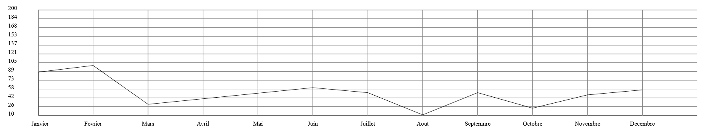
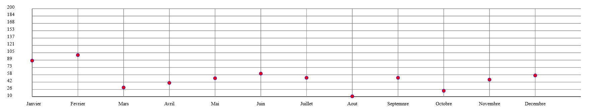
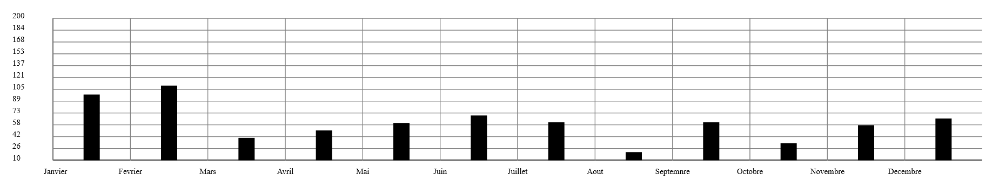
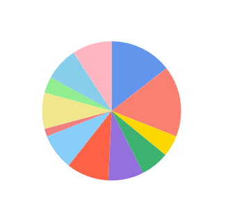
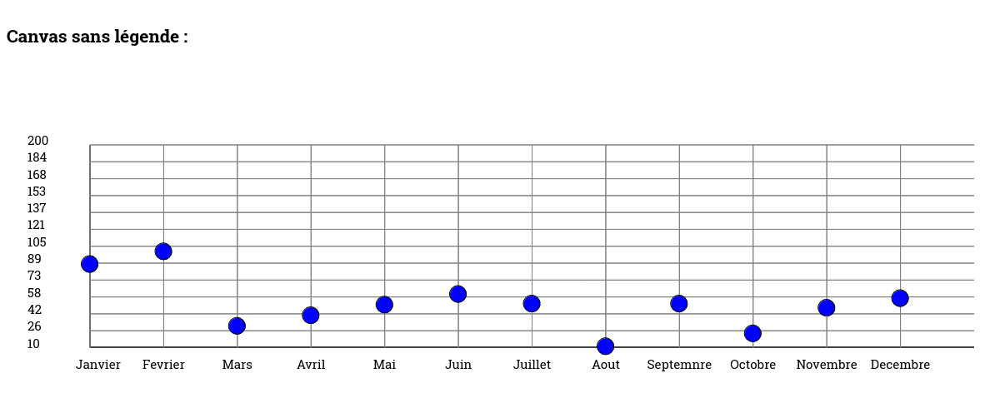
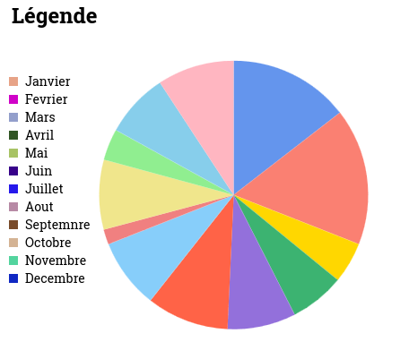
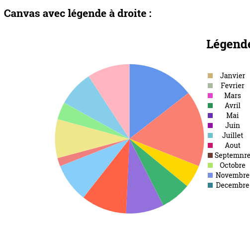
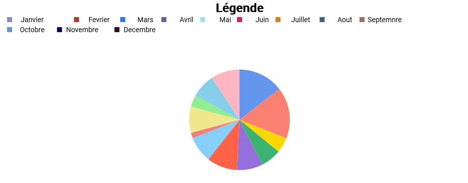
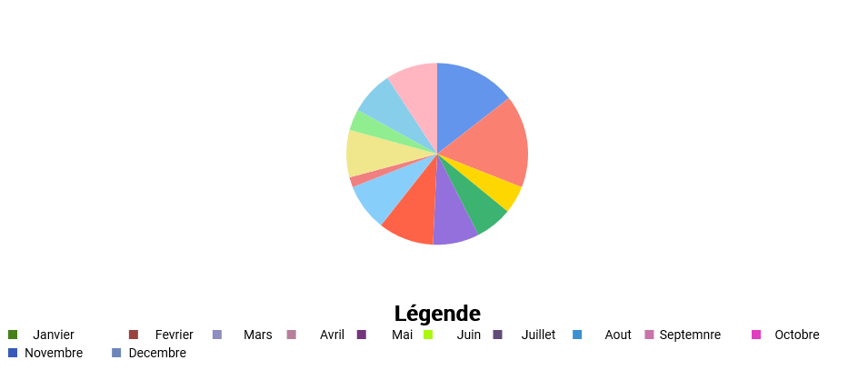

# Wild Chart School

[](#english-version)
[](#french-version)
[](https://wild-chart-lib-sb.netlify.app/)


[](LICENSE)
[](#)
[](#)
[](https://nodejs.org/)
[](https://www.npmjs.com/)
[](#)
[](CONTRIBUTING.md)
[](#)
[](#)


## English Version


## Welcome to your free open-source library for data visualization with React (utilizing PropTypes).

Wild Chart School is a project maintained by the community, contributions are welcome!

Visualize your data in 4 different ways (4 chart types currently: bars, lines, points and pie charts).

The graph is responsive and resizes automatically with the window (unless a specific size is specified).

It can be used as soon as it is installed with test data or by replacing it with its own, while retaining the structure given below.


## Getting started with WildChartSchool

### Installation

Download and install with npm with:

```bash
npm i wcs-chart-lib
```

Or clone this repository  (you will be able to download the library with npm install chart-wcs)

```bash
  git clone git@github.com:WildCodeSchool-CDA-LYON-02-2024/wcs-chart-lib.git

```
    
### Usage

The WCS component allows to display a Chart by passing different props (dataset,
config, theme).

Implementation exemple code (ready-to-use)


``` js
import { WCS } from 'wcs-chart-lib';

function App() {
  const config = {
    type: 'point',
  };

  const dataset = [
    {
      tag: ['Titre1'],
      data: {
        labels: [
          'Janvier',
          'Fevrier',
          'Mars',
          'Avril',
          'Mai',
          'Juin',
          'Juillet',
          'Aout',
          'Septembre',
          'Octobre',
          'Novembre',
          'Decembre',
        ],
        values: [[10, 20, 30, 40, 50, 60, 51, 11, 51, 23, 47, 56]],
      },
    },
  ];

  return (
    <>
      <WCS config={config} dataset={dataset} theme="sea" legend="top" />
    </>
  );
}

export default App;

```
## Theme

The chart has two default themes: "sea" and "nature".

Simply pass the value as a string in the component props.

Without any props, the chart will take "sea" as its default theme.

**Customize your theme**

You can pass an object to the **theme** props with the following values :

| Propriété |Type | Description | Example |
|:---------|:----|:------------|:--------------|
|backGroundColor| String|Change the background color of the canvas| "yellow"| 
|fillColor|Array of string| Change the color of points and bars| ["blue","yellow"]|
|strokeColor| String| Change the color of points | "blue"|
|gridColor|Chaine de caractères| Change the grid color | "grey"|
|axiesColor|Chaine de caractères|Change X and Y axies | "red"|
|adaptFontSizeY|Number(int) negative or positive| Change the size of numbers on the Y axis| 5 |
|adaptFontSizeX|Number(int) negative or positive|Change the size of labels on the X axis| -5|

## Data
 Example of the dataset object, the structure does not change depending on the chart type :

``` js
const dataset = [
    {
      tag: ["Titre1"],
      data: {
        labels: [
          "Janvier",
          "Février",
          "Mars",
          "Avril",
          "Mai",
          "Juin",
          "Juillet",
          "Août",
          "Septembre",
          "Octobre",
          "Novembre",
          "Décembre",
        ],
        values: [[88, 100, 30, 40, 50, 60, 51, 11, 51, 23, 47, 56]],
      },
    },
  ];
```

| Proprety |Type | Description | Example |required|
|:---------|:----|:------------|:--------------|:-------|
|dataset|Array of *object*| The whole structure|  |**Yes**|
|tag| Array of *string* | Title of the chart|["Title1","Title2"]  | No |
|data| Object | Contains labels and value| | **Yes** |
|labels| Array of *string* |Represents the labels associated with the values|["Janurary","February"] | **Yes**|
|values| Array of *array* with number int | The values to display in the chart|[10,20,30] | **Yes**|

⚠ *Note* : To display multiple charts, for comparisons for example, add another array.

If there are multiple arrays, the first one should be the longest, or it will cause bugs!

*Example* : 
```[[10,20,30,40,70], [40,50,60]]``` 
~~```[[40,50,60],[10,20,30,40,70]]```~~

## Chart type

**The different chart types: bar, line, point, pie...** 


The chart type is defined in the config object and is mandatory for the component to function, even if it is empty.
The chart type is defined with type (type string): if no value is supplied, it will default to **“point”**.
Possible values: **“bar”**, “point”, “line”, “pie”.


The configuration examples config explain the properties specific to each type of graphic. If a property is present for one type of graphic and absent for another, it's simply not functional.
type, height and width properties are common to all graphics.

### Chart line

**Example for the line chart :** 
``` js
  const config = {
    type: 'line',
    height: 1000,
    width: 1000,
  };
```
| Proprety |Type | Description | Example |Required| By default |
|:---------|:----|:------------|:--------------|:-------|:----|
|type|String|Defines the chart type | "line"|Yes|"point"|
|height|Number(int)| It's a percentage, it defines the height of the canvas | 50|No|100|
|width|Number (int)| It's a percentage, it defines the width of the canvas |80|No|100|




### Chart point
**Example for the point chart :**
  ``` js
  const config = {
    type: 'point',
    toLine: false,
    grid: true,
    radius: 5,
  };
```
| Proprety |Type | Description | Example |By default|
|:---------|:----|:------------|:--------------|:-------|
|toLine|Boolean| Allows you to connect the points with a line|true|false|
|grid|Boolean|Allows you to remove the grid|false|true|
|radius|Number (int)|Sets the radius of the circle (point)|10|2|




### Chart bar

**Example for the bar chart :** 
 ``` js
 const config = {
    type: 'bar',
    barWidth: 30,
  };
```
| Proprety |Type | Description | Example |By default|
|:---------|:----|:------------|:--------------|:-------|
|barWidth| Number (int) (int)|Allows you to define the width of the bar| 20|15|

⚠ **Note**: Currently, the bar chart can only accommodate two value tables. Beyond that, the result will not be as expected.



### Chart pie

**Example of a pie chart :** 
 ``` js
 const config = {
    type: 'pie',
    radius: 100,
  };
  ```
| Propriété |Type | Description | Exemple |By defaut|
|:---------|:----|:------------|:--------------|:-------|
|radius|Number (int)|Defines the size of the pie chart| 100 | See below|

By default, the radius of the pie chart is half the smaller of width or heigh, minus some spacing (so that the ends of the pie chart are not stuck to the window edges)



**Example of legend display :**
```js
<WCS config={config} dataset={dataset} legend='top' />
```

**Legend takes 4 possible parameters (in string):**
- **"none"** : Legend is not displayed,
- **"top"**: The legend is displayed at the top (note that if the pie chart has a radius greater than 150, it may overflow onto the legend),
- **"bottom"**: The legend is displayed at the bottom (note that if the pie chart has a radius greater than 150, it may overlap the legend),
- **"left"**: The legend is displayed on the left (do not use in charts other than pie chart, otherwise the axis labels will overlap),
- **"right"**: Legend is displayed on the right.


For greater clarity, we'll show you examples with the pie chart.
For other charts, only the "top" parameter is relevant.

*Without legend ("none") :*



*Legend at left ("left") :*



*Legend at right ("right") :*



*Legend on top ("top") :*



*Legend on bottom ("bottom") :*



## French Version
[](LICENSE)
[](#)
[](#)
[](https://nodejs.org/)
[](https://www.npmjs.com/)
[](#)
[](CONTRIBUTING.md)
[](#)
[](#)

## Bienvenue dans votre bibliothèque open source gratuite pour la visualisation des données avec React (utilisant PropTypes).

Wild Chart School est un projet maintenu par la communauté, les contributions sont les bienvenues !

Visualisez vos données de 4 manières différentes (4 types de graphiques actuellement : barres, lignes, points et à secteurs).

Le graphique est responsive et se redimensionne automatiquement avec la fenêtre (sauf si vous passez outre en donnant une taille définie).

Elle est utilisable dès son installation avec des données de test ou en remplaçant celles-ci par les siennes, tout en conservant la structure donnée ci-dessous.

## Commencer avec WildChartSchool

Installer depuis npm :

``` bash
npm i wcs-chart-lib
```

Ou cloner le repo : 
```
https://github.com/WildCodeSchool-CDA-LYON-02-2024/wcs-chart-lib
```

Le composant WCS  permet d’afficher un graphique en passant différentes props (dataset, config, thème)

**Exemple d'implémentation (prêt à l'emploi)  :**
  
 ``` js
import { WCS } from 'wcs-chart-lib';

function App() {
  const config = {
    type: 'point',
  };

  const dataset = [
    {
      tag: ['Titre1'],
      data: {
        labels: [
          'Janvier',
          'Fevrier',
          'Mars',
          'Avril',
          'Mai',
          'Juin',
          'Juillet',
          'Aout',
          'Septembre',
          'Octobre',
          'Novembre',
          'Decembre',
        ],
        values: [[10, 20, 30, 40, 50, 60, 51, 11, 51, 23, 47, 56]],
      },
    },
  ];

  return (
    <>
      <WCS config={config} dataset={dataset} theme="sea" legend="top" />
    </>
  );
}

export default App;

```

## Thème

Le graphique a deux thèmes par defaut : "sea" et "nature".

Passer simplement la valeur en chaine de caractères dans les props du composant.

Sans aucun props, le graphique prendra "sea" en thème par defaut.

**Faire son thème personnaliser**

Vous pouvez passer un objet au props **theme** avec les valeurs suivante :

| Propriété |Type | Description | Exemple |
|:---------|:----|:------------|:--------------|
|backGroundColor| Chaine de caractères|Change la couleur de fond du canvas| "yellow"| 
|fillColor|Tableau de chaine de caractères| Change la couleur des points et des barres| ["blue","yellow"]|
|strokeColor| Chaine de caractères| Change la couleur du contour du point | "blue"|
|gridColor|Chaine de caractères| Change la couleur du quadrillage | "grey"|
|axiesColor|Chaine de caractères|Change la couleur de l'axe X et Y | "red"|
|adaptFontSizeY|Nombre(int) négatif ou positif| Change la taille des nombres sur l'axe Y| 5 |
|adaptFontSizeX|Nombre(int) négatif ou positif|Change la taille des labels sur l'axe X| -5|


## Données
**Exemple de l’objet dataset, la structure ne change pas en fonction du type de graphique :**

``` js
const dataset = [
    {
      tag: ["Titre1"],
      data: {
        labels: [
          "Janvier",
          "Février",
          "Mars",
          "Avril",
          "Mai",
          "Juin",
          "Juillet",
          "Août",
          "Septembre",
          "Octobre",
          "Novembre",
          "Décembre",
        ],
        values: [[88, 100, 30, 40, 50, 60, 51, 11, 51, 23, 47, 56]],
      },
    },
  ];
```

| Propriété |Type | Description | Exemple |Requis|
|:---------|:----|:------------|:--------------|:-------|
|dataset|Tableau d'*objets*| Toute la structure|  |**Oui**|
|tag| Tableau de  *chaine de caractères* | Titre du graphique|["Titre1","Titre2"]  | Non |
|data| Objet | Contient tous les labels| | **Oui** |
|labels| Tableau de *chaine de caractères* |Représente les labels associés aux valeurs|["Janvier","Février"] | **Oui**|
|values| Tableau de *tableau de nombres, int* | The values to display in the chart|[10,20,30] | **Oui**|

⚠ *Note* : pour afficher plusieurs graphiques, pour des comparaisons par exemple, ajouter un autre tableau.

Si plusieurs tableaux, le premier doit être le plus long, ou cela causera des bugs !

*Exemple* : 
```[[10,20,30,40,70], [40,50,60]]``` 
~~```[[40,50,60],[10,20,30,40,70]]```~~


## Types de graphiques
Les différents types de graphiques : **barre, ligne, point, à secteur (camembert)...** 

Le type de graphique se définit dans l’objet **config** et il est obligatoire pour le fonctionnement du composant, même s' il est vide.
Le type de graphique est a définir avec **type** (type string) : si pas de valeur fournis, il prendra “point” par défaut.
Valeurs possibles : **“bar”, “point”, “line”, “pie”**

Dans les exemples de config ci dessous, sont expliquées les propriétés propres à chaque type de graphique, si une propriété est présente pour un type de graphique et absente pour un autre, elle n’est tout simplement pas fonctionnelle.
**Les propriétés type, height, width, sont communes à tous les graphiques**.

### Graphique en ligne

**Exemple pour le graphique en ligne :**
``` js
  const config = {
    type: 'line',
    height: 100,
    width: 100,
  };
```
| Propriété |Type | Description | Exemple |Requis| Par defaut |
|:---------|:----|:------------|:--------------|:-------|:----|
|type|Chaine de caractères|Définit le type de graphique | "line"|Oui|"point"|
|height|Nombre (int)| C'est un pourcentage, il definit la hauteur du canvas | 50|Non|100|
|width|Nombre (int)| C'est un pourcentage, il définit la largeur du canvas |80|Non|100|


### Graphique en points

**Exemple pour le graphique en point:**
``` js
  const config = {
    type: 'point',
    toLine: false,
    grid: true,
    radius: 5,
  };
```
| Propriété |Type | Description | Exemple |Défaut|
|:---------|:----|:------------|:--------------|:-------|
|toLine|Booléen| Permet de relier les points par une ligne|true|false|
|grid|Booléen|Permet d'enlever le quadrillage|false|true|
|radius|Nombre (int)|Définit le rayon du cercle (point)|10|2|


### Graphique en barres
**Exemple pour le graphique en secteur  :** 
  ``` js
  const config = {
    type: 'bar',
    barWidth: 30,
  };
```
| Propriété |Type | Description | Exemple |Défaut|
|:---------|:----|:------------|:--------------|:-------|
|barWidth| Nombre (int)| Permet de definir la largeur de la barre| 20|15|

⚠ **Note** : Pour l'instant, le graphique en barre ne peut accepter que deux tableaux de valeur. Au délà, le rendu ne sera pas celui attendu. 


### Graphique camembert
**Exemple pour le graphique en camembert :**
``` js
  const config = {
    type: 'pie',
    radius: 100,
  };
```

| Propriété |Type | Description | Exemple |Défaut|
|:---------|:----|:------------|:--------------|:-------|
|radius|Nombre (int)|Définit le taille du camembert| 100 | Voir ci-dessous|

Par défaut, le rayon du camembert prend la moitié de la valeur la plus petite entre width et heigh, moins un espacement (pour que les extrémités du camembert ne soient pas collées aux bords de la fenêtre)


Le composant utilise l’API canvas pour dessiner le graphique, est responsive et se resize automatiquement par rapport à la taille de la fenêtre du navigateur.

**Exemple pour l'affichage de la légende :**
``` js
<WCS config={config} dataset={dataset} legend='top' />
```

**Legend** prend 4 paramètres possible (en string):
- **“none”** : La légende ne s’affiche pas,
- **“top”** : La légende s’affiche en haut (attention si pie chart a un radius supérieur à 150, cela peut déborder sur la légende),
- **“bottom”** : La légende s’affiche en bas (attention si pie chart a un radius supérieur à 150, cela peut déborder sur la légende),
- **“left”** : La légende s’affiche à gauche (ne pas utiliser dans les autres graphiques que pie chart sinon les labels de l’axe se chevauchent),
- **“right”** : La légende s’affiche à droite


Pour plus de clarté, nous vous montrerons des exemples avec le camembert.
Pour les autres graphiques, seul le paramètre **“top”** sera pertinent

*Sans légrende ("none") :*


*Légende à gauche ("left"):*


*Légende à droite ("right"):*


*Légende en haut ("top"):*


*Légend en bas ("bottom") :*


